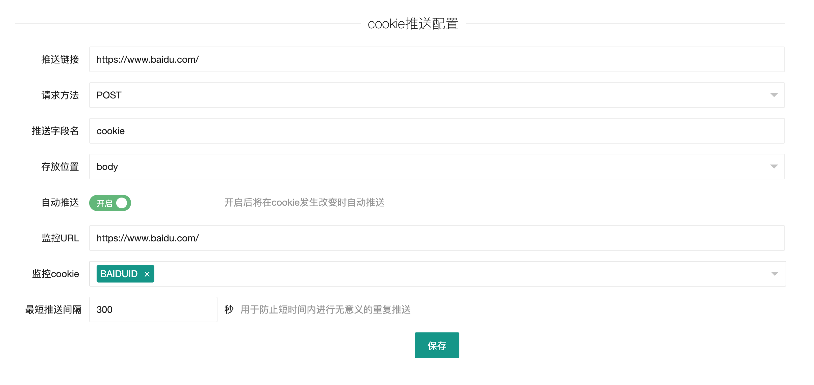

# Cookie推送工具 

使用全新的MV3（Manifest V3）开发的Chrome扩展程序，用于提取网站的Cookie，手动或自动推送到服务器。

方便用于爬取一些登录验证方式比较难破解的网站，直接浏览器端登录，服务器接收cookie即可。

并且重新登录之，还可以自动推送新生成的cookie到服务器端。

### 功能特点
* 自定义服务器地址
* 页面右键菜单提取
* 可将Cookie上传至服务器
* 可将Cookie拷贝至剪切板
* 可配置自动推送
* 指定域名下的cookie发生变动时自动推送到服务器

### 安装
* chrome浏览器，设置 --> 更多工具 --> 扩展程序
* 勾选开发者模式
* 选择加载已解压的扩展程序，选择clone下来的cookie-push目录

### 使用
* 点击浏览器“Cookies提取助手”扩展程序按钮，选择选项，进入配置界面
* 填写API等相关信息
* 在需要推送cookie的页面点击鼠标右键
* 选择“Cookies推送工具”
* 选择“复制cookie”或"推送cookie"

### 参数说明

- 推送链接：接收cookie的服务器地址
- 请求方法：POST或PUT，推送时的`Content-type `均为`application/json `
- 推送字段名：用于接收cookie数据的变量名
- 推送格式：服务器接收cookie的字段类型
- 自动推送：开启后，将在cookie发生改变时自动推送给服务器
- 监控域名：自动推送监控的域名，可输入URL，会自动获取顶级域名
- 监控cookie：未设置时，监控域名下的任意cookie发生变化都将进行推送，设置之后，只有监控列表中的cookie发生变化时才会推送给服务器
- 最短推送间隔：两次推送的最短时间间隔，登录时，可能会产生很多cookie，每次变化都会收到回调信息，这个参数主要用于防止推送cookie过于频繁。