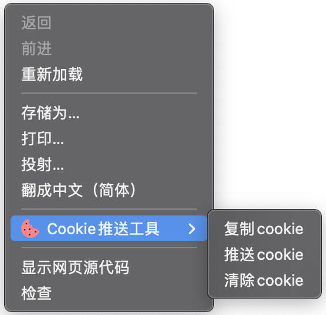

# Cookie推送工具 

使用全新的MV3（Manifest V3）开发的Chrome扩展程序，用于提取网站的Cookie，手动或自动推送到服务器。

方便用于爬取一些登录验证方式比较难破解的网站，直接浏览器端登录，服务器接收cookie即可。

### 功能特点
* 自定义服务器地址
* 页面右键菜单提取
* 可将Cookie上传至服务器
* 可将Cookie拷贝至剪切板
* 可一键清空当前页面下的Cookie

### 安装
* chrome浏览器，设置 --> 更多工具 --> 扩展程序
* 勾选开发者模式
* 选择加载已解压的扩展程序，选择clone下来的cookie-push目录

### 使用
* 点击浏览器“Cookies提取助手”扩展程序按钮，选择选项，进入配置界面
* 填写API等相关信息
* 在需要推送cookie的页面点击鼠标右键
* 选择“Cookies推送工具”
* 选择“复制cookie”或"推送cookie"

